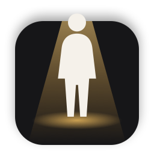

<p align="center">
  
</p>

<h1 align="center">Cameo</h1>

<p align="center">
  一款輕巧的 macOS 選單列 App，把帶透明通道的角色影片放到你的桌面上。
</p>

<p align="center">
  <a href="https://github.com/wquguru/cameo/actions/workflows/build.yml"></a>
  
  
  <a href="LICENSE"></a>
</p>

<p align="center"><a href="README.md">English</a> · <a href="README.zh-CN.md">简体中文</a> · <a href="README.zh-TW.md">繁體中文</a> · <a href="README.ja.md">日本語</a> · <a href="README.ko.md">한국어</a> · <a href="README.es.md">Español</a> · <a href="README.fr.md">Français</a> · <a href="README.de.md">Deutsch</a></p>

---

Cameo 會把一段帶 Alpha 通道、循環播放的影片變成懸浮在桌面上的角色，永遠位於所有視窗之上，在每個「空間」中都看得到。你可以把角色拖到任何位置；點按它的透明像素時，點按會直接穿透到下方的內容。

## 功能特色

- **內建一隻貓**：Chaofei 是一隻以程式碼繪製的銀色虎斑英國短毛貓，照著作者自家的貓畫成，會沿著螢幕底部四處閒晃：走路、坐下、趴下打盹、站起來、打滾。點按牠會打滾，拖移就能把牠拎起來，也可以在彈出視窗中固定某個動作。
- **真正透明**：只有角色的可見像素會回應滑鼠，其他區域一律點按穿透。
- **永遠在最上層**：在每個「空間」中都浮在所有視窗之上。
- **原生格式**：支援 HEVC with Alpha 與 ProRes 4444（`.mov`），由 AVFoundation 解碼。不需要 FFmpeg，也不內附編解碼器。
- **省資源**：被全螢幕 App 遮住或螢幕睡眠時會暫停播放，使用電池時最高 30 fps。
- **極簡**：只有一個選單列彈出視窗：顯示/隱藏、角色、大小、登入時啟動。沒有設定視窗，沒有相依套件。

## 系統需求

- macOS 14 Sonoma 或以上版本（Apple 晶片或 Intel）
- 從原始碼建置：Xcode 命令列工具（`xcode-select --install`）

## 安裝

### 下載

從 [Releases](https://github.com/wquguru/cameo/releases) 下載 **`Cameo-<version>-macOS-Universal.dmg`**：一個安裝檔同時適用於搭載 Apple 晶片和 Intel 處理器、執行 macOS 14 或以上版本的 Mac。打開後將 **Cameo** 拖到「**應用程式**」即可。旁邊另附只含 App 本身的 `.zip` 和 `checksums.txt`（SHA-256）。

此 App 使用 ad-hoc 簽署（未經公證）。第一次開啟時 macOS 會加以阻擋：請打開「**系統設定 › 隱私權與安全性**」並按一下「**強制打開**」，或執行 `xattr -dr com.apple.quarantine /Applications/Cameo.app`。

### 更新

Cameo 每天會檢查一次 GitHub Releases，你也可以在彈出視窗中按一下「**檢查更新…**」。有新版本推出時，選單列圖像會出現一個琥珀色圓點，該列也會變成「**更新至 x.y.z**」：按一下後，Cameo 會下載新版本、驗證其檢查碼、取代自身並重新打開。如果無法取代自身（例如不在「應用程式」檔案夾中），則會改為開啟發佈頁面。「**關於 Cameo**」會顯示版本，並附上專案連結。

### 語言

Cameo 支援 English, 简体中文, 繁體中文, 日本語, 한국어, Español, Français, Deutsch, Português (Brasil), Русский 和 Italiano。預設會跟隨 Mac 的語言；若要選擇其他語言，請使用彈出視窗中的「**語言**」，或前往「系統設定 › 一般 › 語言與地區 › 應用程式」。

### 從原始碼建置

```bash
git clone https://github.com/wquguru/cameo.git
cd cameo
scripts/build.sh          # → build/Cameo.app
open build/Cameo.app
```

## 使用方式

1. 按一下選單列中的 Cameo 圖像（一個從螢幕裡探出頭的小人）。
2. 用 **+** 加入影片、把影片拖放到彈出視窗上，或在 Finder 中使用「**打開檔案的應用程式 → Cameo**」。
3. 選擇角色，再把它拖到你喜歡的位置。

在角色卡片上按右鍵即可刪除。匯入的影片會拷貝到 `~/Library/Application Support/Cameo/Characters`。

## 角色

### 角色庫

到 **[wquguru.github.io/cameo](https://wquguru.github.io/cameo/)** 瀏覽免費角色，按一下**Add to Cameo**：App 會下載該角色並切換過去（透過 `cameo://add?url=…` 連結）。

### 製作角色

一個角色就是一段帶 Alpha 通道、可循環播放的 `.mov`（HEVC with Alpha 或 ProRes 4444）。最簡單的方式是讓你的程式設計 agent 使用隨附的 [`cameo-character`](skills/cameo-character/SKILL.md) skill 來製作：

```bash
npx skills add wquguru/cameo --skill cameo-character
```

或直接告訴你的 agent：*「安裝這個 skill：https://github.com/wquguru/cameo/tree/main/skills/cameo-character」*。接著請它把一段綠幕影片做成角色，或幫你撰寫用 AI 影片工具生成角色的提示詞。它會去除背景、檢查成果，並將角色加入 Cameo。

若要手動處理已帶 Alpha 通道的影片：

```bash
ffmpeg -i in.mov -c:v hevc_videotoolbox -alpha_quality 0.75 -pix_fmt bgra -tag:v hvc1 -b:v 6M out.mov
# or Apple's built-in tool
avconvert -s in.mov -o out.mov -p PresetHEVCHighestQualityWithAlpha
```

做出滿意的角色了嗎？[投稿到角色庫](https://github.com/wquguru/cameo/issues/new?template=character.yml)。

## 開發

```bash
swift build               # debug build
scripts/build.sh          # release app bundle in build/Cameo.app
scripts/package.sh        # universal .dmg, .zip and checksums.txt in build/
swift run CameoSample sample.mov                       # a test clip with alpha
scripts/gallery-add.sh in.mov <id> "<name>" "@author"  # publish a gallery character
```

| 路徑 | 用途 |
| --- | --- |
| `Sources/Cameo` | App 本體（AppKit、SwiftUI 彈出視窗、AVFoundation 播放） |
| `Sources/CameoSample` | 產生 HEVC Alpha 範例影片的命令列工具 |
| `Sources/CameoIcon` | 繪製 App 圖示的命令列工具 |
| `design/` | 設計參考檔案（用瀏覽器打開） |
| `gallery/` | 角色庫網站，部署到 GitHub Pages |
| `skills/cameo-character` | 製作角色的 agent skill |

### 發佈版本

```bash
scripts/release.sh 0.3.0   # bumps Info.plist, commits, tags v0.3.0 and pushes
```

`release` 工作流程會建置該標籤對應的提交、確認標籤與 `Info.plist` 一致，然後把 `.dmg`、`.zip` 和 `checksums.txt` 發佈到 GitHub Releases。

## 參與貢獻

歡迎提交 Issue 與 Pull Request。Cameo 刻意保持精簡，因此新增介面之前，請先開 Issue 討論新功能。範圍與慣例請參閱 [AGENTS.md](AGENTS.md)。

## 授權條款

[Apache License 2.0](LICENSE)
